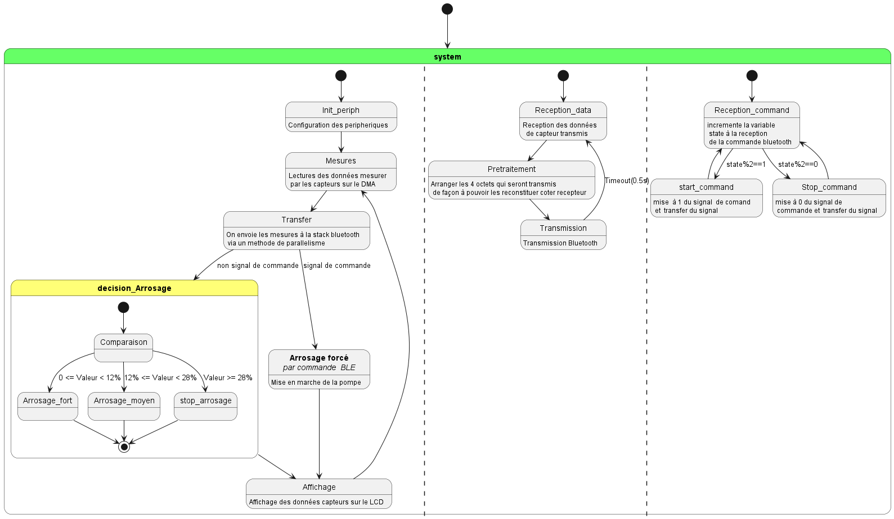
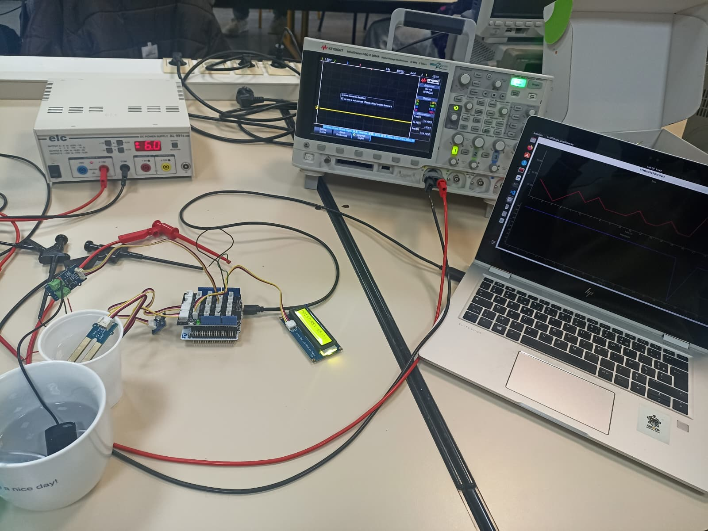

## STM32_2026_G14
Ce dépôt github, contient l'ensemble des codes pour la réalisation du bureau d'étude.  

# SYSTEM D'ARROSAGE AUTOMATIQUE ET COMMUNICATION BLUETOOTH
### Machine état du Système
Les deux services du bluetooth fonctionnent en parallèle avec le système d'asservissement.
Le diagramme ci-dessous est une representation en l'état du fonctionnement globale du système.

### Réalisation
La figure ci-dessus montre le montage finale et on peut y voir le graphique visuel des signaux bluetooth qui y sont décodés.

