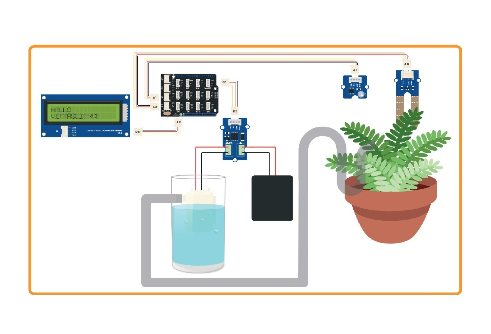
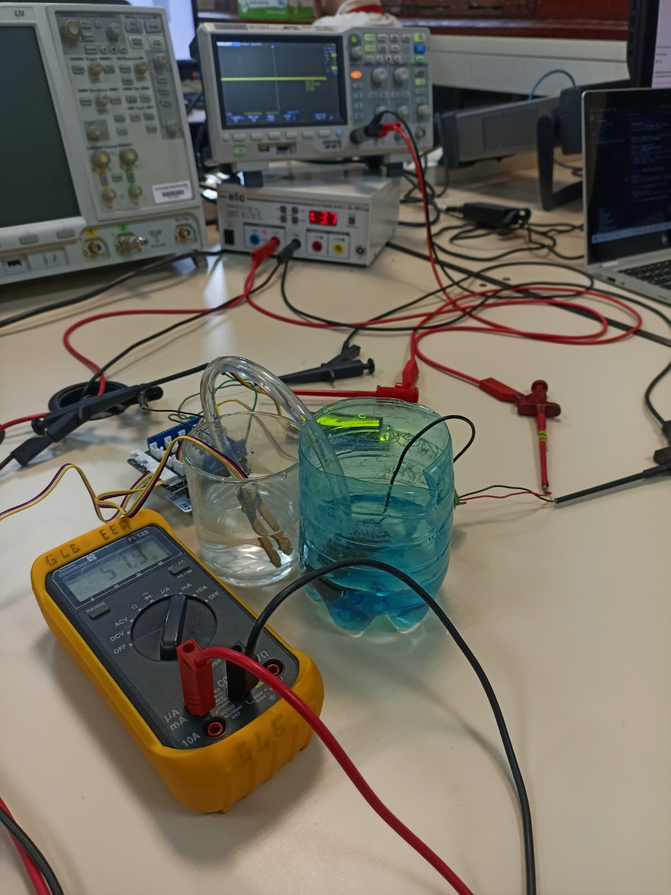
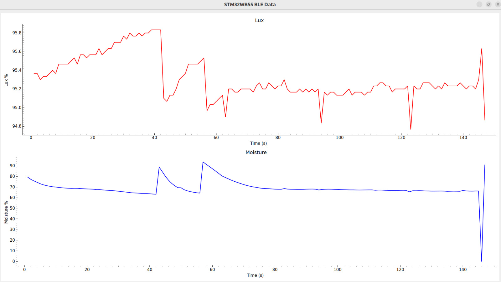

# STM32_2026_G14
***Aperçu*** : Ce dépôt github, contient l'ensemble des codes pour la réalisation du bureau d'étude.  

## Système d'Arrossage Automatique d'une plante Connectée et Communication Bluetooth avec le STM32WB55RG

### Schéma de Cablage du Système

### Machine état du Système
Les deux services du bluetooth fonctionnent en parallèle avec le système d'asservissement.
Le diagramme ci-dessous est une representation en l'état du fonctionnement globale du système.

### Réalisation

## Montage sous Alimentation Externe 
On a connecté la carte sous l'alimentation stable de +3.7V par le générateur DC.

La consommation Electrique est de **3.7V\*57.9mA = 0.21423W.**

Ci dessous le montage du système cablé en salle 3A-G45 :

#### Visualisation des données Lux et Moisture 
Le graphe des données des capteurs obtenu via bluetooth.
Pour la visualisation de ces Données sous forme graphique nous avons utilisé Python.

